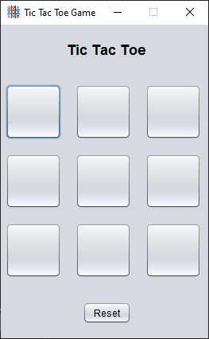
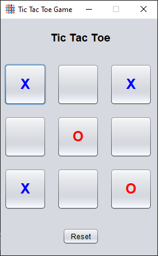

# 🎮 Tic Tac Toe (Java Swing)

A simple and interactive **Tic Tac Toe game** built using **Java Swing GUI**.
This project demonstrates basic GUI development, event handling, and game logic in Java.

---

## 🚀 Features

* ✅ Two-player mode (X vs O)
* 🎨 Colored moves

  * **X → Blue**
  * **O → Red**
* 🟰 Detects **Draw condition**
* 🏆 Winner popup message
* 🔁 Reset button to restart game
* 🔒 Fixed-size buttons (clean UI)
* 🪟 Custom window title and icon
* 🚫 Disabled maximize option

---

## 🖥️ Screenshots




---

## 🛠️ Technologies Used

* ☕ Java
* 🧩 Swing (GUI Framework)
* 🧠 Event Handling

---

## 📂 Project Structure

```
TicTacToe/
│── src/
│   ├── TicTacToe.java
│   └── images/
│       └── logo.png
│── README.md
```

---

## ▶️ How to Run

1. Open project in **NetBeans / IntelliJ / Eclipse**
2. Compile the program
3. Run `TicTacToe.java`

OR using terminal:

```bash
javac TicTacToe.java
java TicTacToe
```

---

## 🎯 Game Rules

* The game is played on a **3×3 grid**
* Players take turns placing:

  * ❌ X
  * ⭕ O
* First player to align 3 symbols:

  * Row / Column / Diagonal → **Wins**
* If all cells are filled → **Draw**

---

## 💡 Future Improvements

* 🤖 Single-player mode (AI)
* 🟩 Highlight winning line
* 🔊 Sound effects
* 🧮 Scoreboard system
* 🎨 Modern UI design

---

## 📌 Author

  **Darshan JK**

---

## ⭐ Support

If you like this project:

* ⭐ Star this repo
* 🍴 Fork it
* 📢 Share with others

---

## 📄 License

This project is open-source and free to use.
